# Gene Knockout Analysis with GeneFormer Embeddings

In-silico perturbation workflow for simulating gene up-regulation and down-regulation in ALS motor cortex single-nucleus RNA-seq data, using GeneFormer V2 embeddings to analyze perturbation effects in a biologically informed latent space.

---

## A (very) brief understanding of the disease

Sporadic ALS is driven by TDP-43 proteinopathy. TDP-43 is encoded by TARDBP and resides in the nucleus, regulating RNA splicing. In the disease it mislocalizes to the cytoplasm, causing loss of nuclear function and toxic aggregation. We have cryptic exon inclusion in STMN2 and UNC13A, this leads to the loss of these proteins.
This dataset contains only sporadic ALS patients, without C9orf72 repeat expansion, which means that the pathology is TDP-43 driven.
In the analysis we will see (SPOILER) that TARDBP knockout worsens disease while STMN2 knockout reverses it (STMN2 dysregulation being a downstream consequence of the TDP-43 pathology).

## A (very) brief understanding of GeneFormer

GeneFormer takes raw integer counts as input. Internally it divides each gene's expression by that gene's median expression across its 104M-cell pretraining corpus. After this it rank-orders genes by normalized value and keeps the top genes (up to 4096). Each retained gene becomes a token. The expression value itself is discarded; only the rank position matters. The transformer processes this token sequence through 12 layers of bidirectional self-attention and produces a 512-dim cell embedding which is the average of the token embeddings.

---

## Task 1: Design an In-Silico Perturbation Workflow

> *"Develop a workflow to simulate knock-up and knock-down experiments for specified genes. The workflow should provide flexibility for scaling to multiple genes."*

### Strategy

We design a **graded expression-scaling perturbation** rather than binary knockout/overexpression. For each target gene, we multiply its raw expression counts by a scaling factor (0 = knockout, 0.1 = strong knock-down, 0.5 = moderate knock-down, 1.5/2/5/10 = knock-up at increasing doses), then re-embed the cell through GeneFormer V2.

**Why this approach:** GeneFormer tokenizes cells by rank-ordering genes by expression and keeping the top 4,096. Scaling a gene's expression changes its position in the rank ordering, which changes the token sequence, which changes the embedding. This is more biologically realistic than GeneFormer's built-in `delete` (remove token entirely) or `overexpress` (force to rank 1), because real gene regulation is continuous, not binary.

More specifically, GeneFormer's native perturber (not available through the Helical SDK) supports four modes: delete, overexpress, activate/inhibit. All of these work on rankings and not on expression levels. In order to have better biological interpretation and given that the ranking is in a way one of the limitations of the model itself, I decided to try scaling raw counts by a factor. Antisense therapies achieve 50-80% knockdown, whereas CRISPRa activation achieves a 2-10x upregulation. Taking these as a reference I built the grading.

### Workflow

1. **Baseline embedding**: embed ALL 112K cells through GeneFormer → 112K vectors of 512 dimensions. Done once.
2. **Centroids**: average the PN cell embeddings (healthy centroid) and ALS cell embeddings (disease centroid). Compute the disease→healthy direction vector.
3. **Select** target gene and dose factor
4. **Perturb**: `perturb_gene(adata, gene, factor)` copies the AnnData, multiplies the target gene's counts by the factor, rounds to integers
5. **Tokenize**: `geneformer.process_data(perturbed_adata)` normalizes by corpus medians, rank-orders, keeps top 4096, converts to tokens
6. **Embed**: `geneformer.get_embeddings(dataset)` runs the 12-layer transformer, mean-pools token embeddings → 512-dim cell embedding
7. **Measure shift per cell**: cosine distance and Euclidean distance between perturbed and baseline embedding for that same cell
8. **Repeat** for all genes × all dose levels
9. **Score reversal**: project each cell's shift vector onto the disease→healthy direction; average across all cells; positive = therapeutic

The workflow scales to any number of genes via `run_perturbation_experiment()`. For speed, `scripts/run_perturbations_parallel.py` distributes gene × dose combinations across multiple GPUs.

### Data exploration

**Dataset:** 112,014 nuclei × 22,832 genes from BA4 (primary motor cortex) of 33 donors. Sporadic ALS (66,960 cells) vs post-mortem normal controls (45,054 cells). No C9orf72 expansion carriers; all TDP-43-driven pathology. 19 cell types across 4 classes (excitatory neurons, glia, inhibitory neurons, vascular).

| Property | Value |
|----------|-------|
| Cells | 112,014 |
| Genes | 22,832 |
| Condition | ALS (67K) vs PN (45K) |
| Cell types | 19 (via CellType), 40 (via SubType) |
| Sparsity | 84.2% |
| Donors | 33 |

**QC:** Data is pre-filtered by Pineda et al. Median ~4,000 genes/cell, ~15,000 counts/cell, low mitochondrial content (<5%).

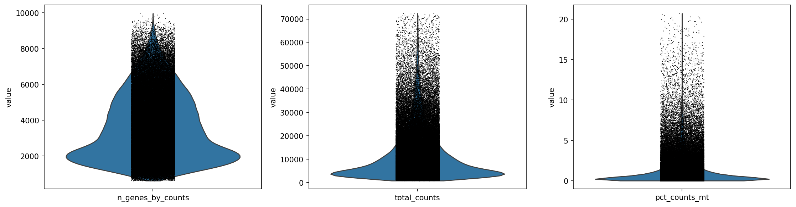

**Scanpy UMAP:** 33 Leiden clusters with clear cell type separation. Critically, ALS and PN cells are well-mixed within cell type clusters; disease effects are subtle transcriptome-wide perturbations of existing cell populations, not the creation of novel disease-specific cell states. This is consistent with Pineda et al.'s findings.

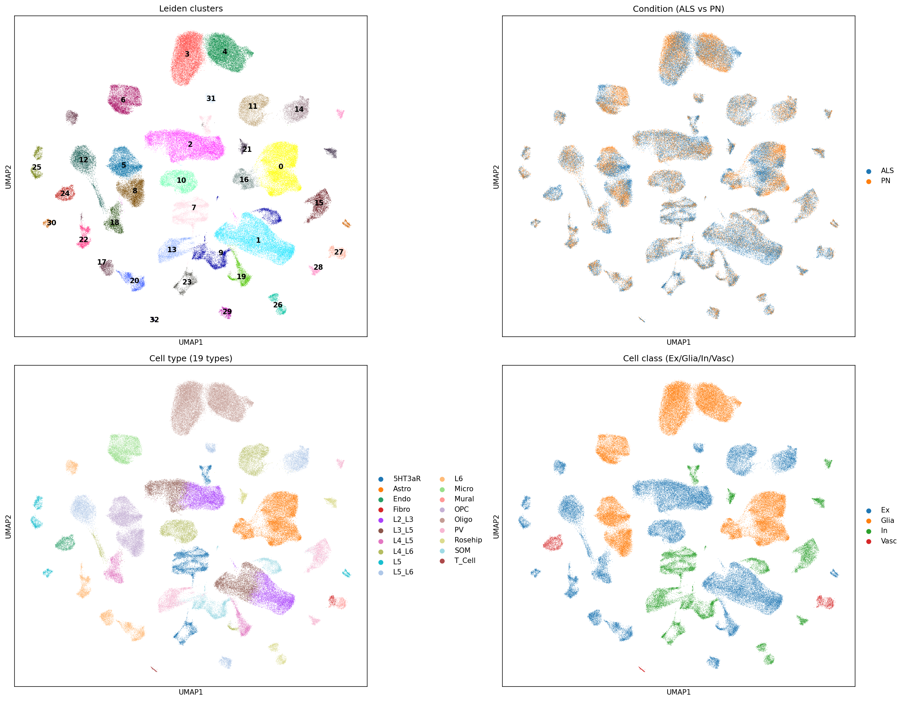

**GeneFormer UMAP:** GeneFormer embeddings produce a different topology from PCA-based UMAP; clusters are more compact, capturing complementary transcriptomic structure. Cell type separation is maintained. The ALS/PN mixing confirms that perturbation effects will be subtle.

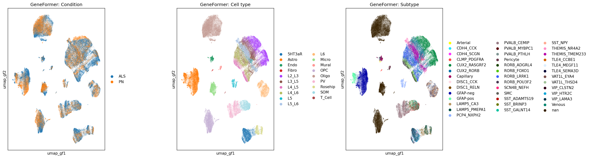

**Differential expression:** 11,024 DE genes (FDR < 0.05) between ALS and PN. Strong downregulation bias (8,410 downregulated vs 2,614 upregulated), consistent with the transcriptomic shutdown characteristic of neurodegeneration. Top downregulated: HSPA6, HSPA1A (heat shock proteins; stress response failure). STMN2 (a direct downstream target of TDP-43) is among the most significantly altered genes.

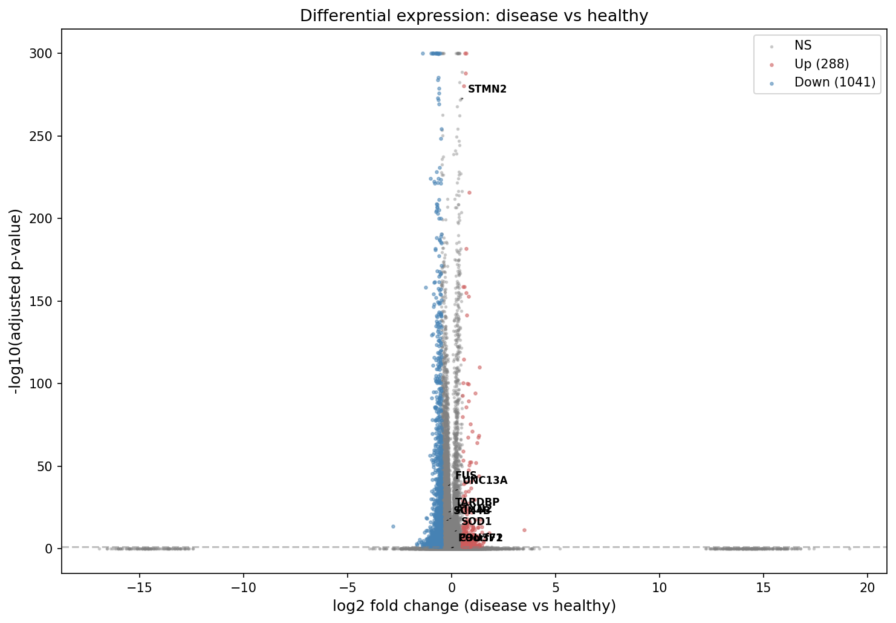

**Dose-response validation (TARDBP pilot):** We validated the pipeline with a TARDBP pilot on 2,000 cells across 5 dose levels. The baseline control (factor=1.0) confirmed near-zero shift. Cosine distance was on the order of 1e-5 (very small angular changes in 512-dim space); poorly discriminative at this scale. We adopted the **reversal score** (directional projection of the shift vector onto the disease→healthy axis) as the primary metric, as it captures WHERE the embedding moves rather than just how far.

---

## Task 2: Apply Perturbations to Disease-Specific Genes

> *"Utilize the workflow to target previously-reported disease-specific genes which contribute to pathology in amyotrophic lateral sclerosis (ALS). Simulate perturbations in healthy or/and diseased cells and process the resulting data using the GeneFormer_V2 (gf-12L-95M-i4096) model to embed the perturbation effects into a biologically informed latent space."*

### Strategy

We selected 12 ALS disease genes from two sources:

**Canonical ALS genetic drivers:**
- **TARDBP** (TDP-43); proteinopathy present in ~97% of sALS; nuclear-to-cytoplasmic mislocalization
- **SOD1**; first ALS gene discovered; protein aggregation (tofersen approved 2023)
- **FUS**; RNA-binding protein; cytoplasmic aggregation
- **C9orf72**; most common genetic cause (though no expansion carriers in this dataset)

**Downstream effectors and therapeutic targets:**
- **STMN2**; stathmin-2; directly regulated by TDP-43; axonal maintenance
- **ATXN2**; ataxin-2; risk modifier; ASO in clinical trials
- **UNC13A**; cryptic exon target of TDP-43; recently identified key mediator

**From the Pineda et al. dataset:**
- **POU3F1**; transcription factor enriched in Betz/VEN neurons; altered localization + TDP-43 co-aggregation
- **SCN4B**; marks vulnerable L3/L5 projecting neurons

**Cellular stress / vulnerability pathways:**
- **OPTN**; optineurin; autophagy receptor
- **TBK1**; TANK-binding kinase 1; innate immunity + autophagy
- **NEK1**; DNA damage response; GWAS risk gene

### Expression in ALS vs healthy

All 12 genes show modest upregulation in ALS (log2FC 0.001–0.63), with SCN4B showing the strongest fold change (0.63). Expression levels range from very low (POU3F1: mean 0.06 counts) to moderate (STMN2: mean 2.91 counts).

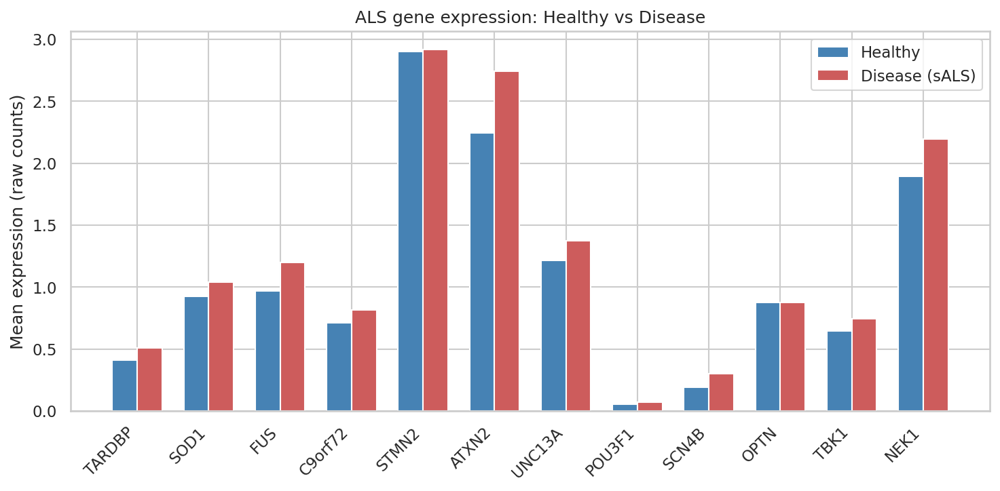

### GeneFormer tokenization visibility

**Critical analysis:** GeneFormer tokenizes each cell by rank-ordering genes and keeping only the top 4,096 (of 22,832 total). Genes below this cutoff are invisible to the model. We verified that **all 12 ALS genes are within the tokenization window** in >50% of cells, with ATXN2 (98%) at the top and POU3F1 (67%) closest to the boundary.

| Gene | Median rank | In top 4096 | Visible |
|------|------------|-------------|---------|
| ATXN2 | 901 | 98.1% | Yes |
| NEK1 | 1,154 | 96.2% | Yes |
| STMN2 | 1,451 | 97.2% | Yes |
| FUS | 1,763 | 90.8% | Yes |
| UNC13A | 1,808 | 94.9% | Yes |
| SOD1 | 1,984 | 90.0% | Yes |
| OPTN | 2,027 | 90.2% | Yes |
| C9orf72 | 2,083 | 87.1% | Yes |
| TBK1 | 2,122 | 86.6% | Yes |
| TARDBP | 2,373 | 80.1% | Yes |
| SCN4B | 2,739 | 73.8% | Yes |
| POU3F1 | 3,050 | 66.8% | Yes |

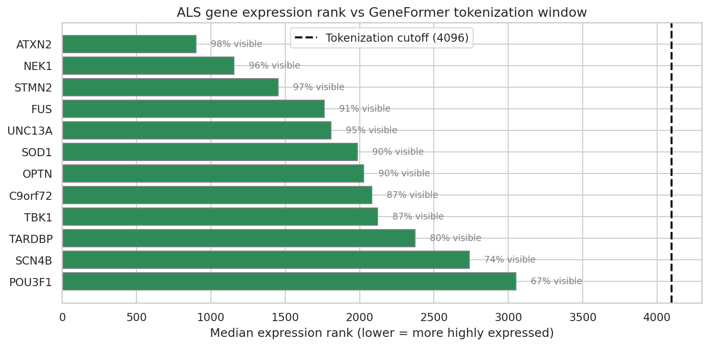

**Implication:** POU3F1 is a transcription factor with very low expression (mean 0.06, 4.5% nonzero) that is still visible to GeneFormer in 67% of cells. In the remaining 33%, perturbation has no effect. This is a fundamental limitation of rank-based tokenization with a fixed context window; biologically critical but lowly expressed regulatory genes can be partially invisible to the model. GRN-based approaches (CellOracle) or knowledge-graph methods (GEARS) do not have this limitation.

### Perturbation execution

- **Disease cells (ALS):** 20,000 subsampled from 66,960 × 12 genes × 7 dose levels = 84 conditions
- **Healthy cells (PN):** 10,000 subsampled from 45,054 × 12 genes × 7 dose levels = 84 conditions
- **Total:** 168 perturbation conditions, parallelized across 8× A100 GPUs (~72 min)
- **Disease-to-healthy reversal scoring:** For each perturbation of disease cells, we project the mean embedding shift vector onto the disease→healthy centroid direction. Positive = moving toward healthy state.

### Perturbation results

**Perturbation effect heatmap (cosine distance):** Shows the magnitude of embedding shift per gene × dose in disease cells. ATXN2 produces the strongest shifts overall (cos_dist up to 0.0002 at knockout and extreme_up). FUS shows a strong asymmetric response; much larger shifts at high upregulation (0.0002) than at knockout. POU3F1 and SCN4B show near-zero effects across all doses, confirming the tokenization visibility limitation.

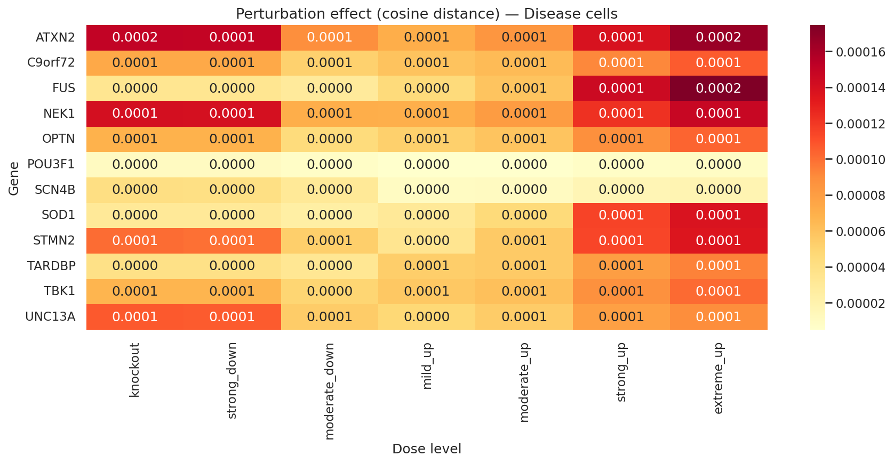

**Disease reversal analysis** is presented in Task 3 after correcting for compositional confound (8/12 genes are neuronal markers with 4-42x enrichment; global centroid-based reversal is confounded by cell-type composition differences between ALS and PN).

---

## Task 3: Interpret the Embedding Space

> *"Analyze the effects of the perturbations by visualizing and interpreting the resulting embedding space. Consider metrics such as clustering, shifts in embedding coordinates, and neighborhood analysis to infer the impact of perturbations on disease-associated gene networks."*

### Strategy

Seven complementary analyses, plus a critical correction for compositional confound:
1. UMAP visualization
2. Embedding shift magnitude (disease vs healthy cells)
3. Cell-type-specific sensitivity (vulnerable neurons)
4. Disease reversal scoring (centroid projection)
5. KNN neighborhood analysis
6. E-distance (distributional metric)
7. Statistical testing (permutation null, 50 random genes)
8. Per-cell-type correction for compositional confound

### Results

**Perturbation UMAP overlay:** Perturbed disease cells (red) overlay closely on the baseline embedding (gray), consistent with the small cosine distances observed. The perturbation effects are subtle in UMAP projection; the rank-based tokenization changes are captured in the high-dimensional embedding but compress in 2D.

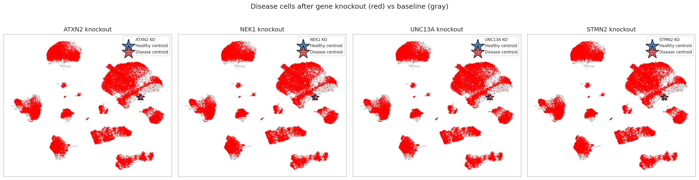

**Knockout sensitivity (disease vs healthy):** ATXN2 and NEK1 produce the largest embedding shifts in both conditions. Error bars are large relative to means, reflecting high cell-to-cell variability across the heterogeneous cell population. The disease/healthy differential is small for most genes; perturbation effects are more gene-dependent than condition-dependent.

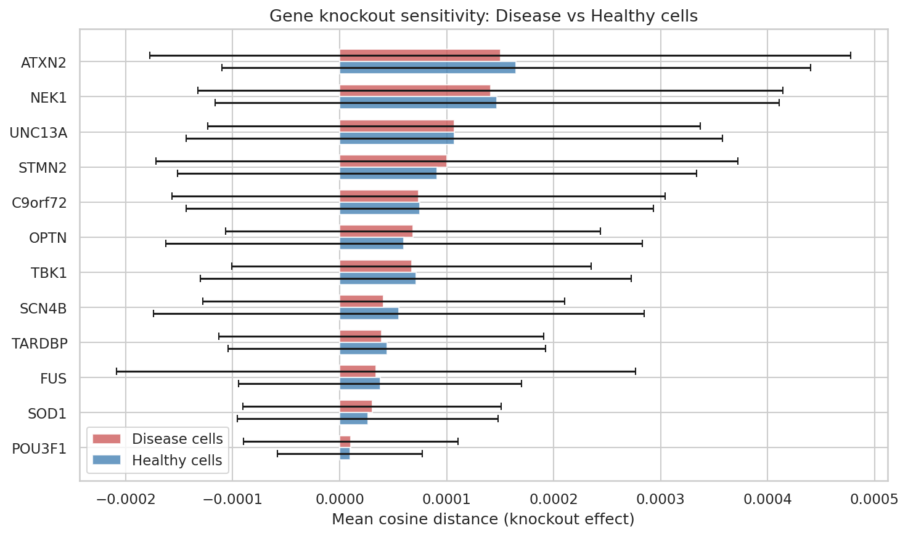

**Cell-type-specific sensitivity:** NEK1 and ATXN2 show the strongest cell-type-specific effects, with notable hotspots in **L3_L5 and L4_L5 excitatory neurons** (cos_dist up to 0.0002). These are the layer 3/5 projection neurons that include the vulnerable Betz cells; the perturbation preferentially affects the cell types most impacted in ALS. POU3F1 shows zero effect across all cell types (tokenization boundary).

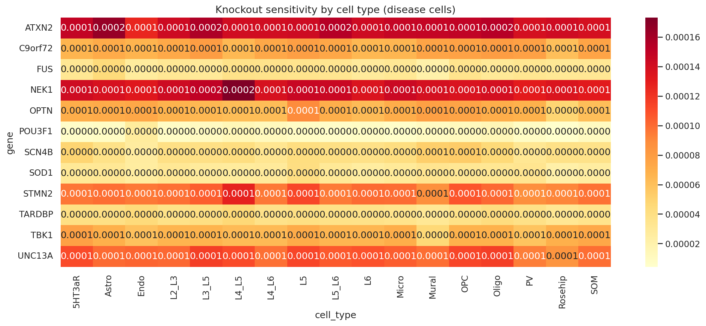

**Disease reversal (global, uncorrected):** STMN2 knockout produces the strongest global reversal toward healthy (+0.006), followed by NEK1 (+0.0024) and SOD1 (+0.0015). UNC13A knockout pushes away from healthy (-0.0008); biologically correct since UNC13A loss mimics TDP-43 cryptic exon pathology.

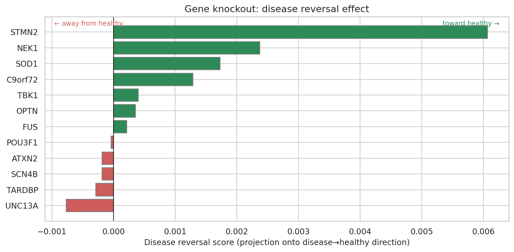

**Reversal dose-response (global):** STMN2 (purple) shows the strongest dose-dependent reversal; knock-down reverses disease, knock-up worsens it. NEK1 (dark blue) has the steepest negative slope at high doses. Most genes cluster near zero, confirming that only a subset of ALS genes produce meaningful directional shifts.

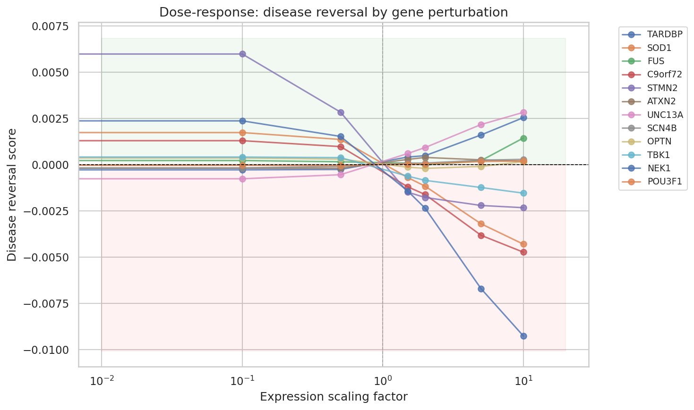

**KNN neighborhood analysis:** Measures the change in fraction of healthy neighbors (K=50) after knockout. This shows a **different pattern** from centroid-based reversal; STMN2 and NEK1 knockouts decrease healthy neighbors locally, while UNC13A and ATXN2 increase them. This discrepancy arises because KNN measures local neighborhood composition while centroid reversal measures global direction; the two metrics capture complementary aspects of the embedding geometry.

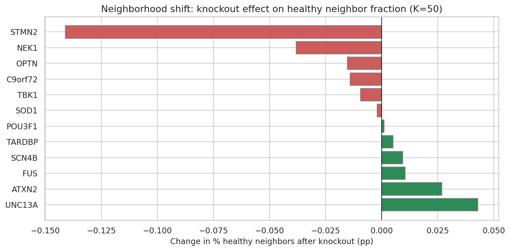

**E-distance (distributional metric):** All genes cluster tightly (0.0102–0.0104), with ATXN2 slightly highest. The lack of discrimination indicates that single-gene perturbation effects are small relative to cell-to-cell variability. This is consistent with recent benchmarks showing foundation model perturbation effects are subtle.

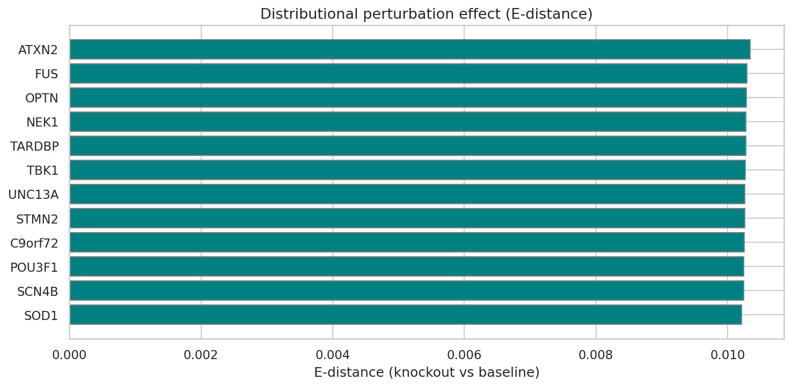

**Statistical testing (permutation null):** We knocked out 50 random expressed non-ALS genes to build a null distribution. ATXN2 (z=2.0, p=0.06) and NEK1 (z=1.8, p=0.06) approach but do not reach conventional significance. The **direction** of the shift (reversal score) is more informative than the magnitude; STMN2 has the strongest reversal despite ranking 4th in raw shift magnitude.

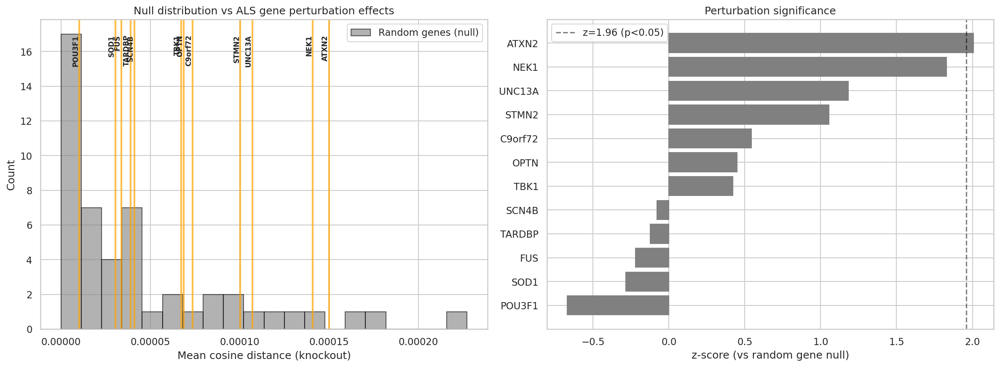

**Directional asymmetry:** All 12/12 genes show opposite knock-down vs knock-up directions (negative cosine similarity between shift vectors). This validates the perturbation design; every gene moves in opposite directions when reduced vs amplified, confirming gene-specific rather than random shifts.

### Correcting for compositional confound

Cell type proportions differ between ALS and PN (ALS has 5% fewer oligodendrocytes, 4% more L2_L3 neurons). More critically, 8 of 12 ALS genes are neuronal markers with 4–42x enrichment in neurons vs glia:

| Gene | Neuron/Glia ratio | Confound risk |
|------|------------------|---------------|
| FUS | 2.2x | LOW (ubiquitous) |
| ATXN2 | 2.6x | LOW (ubiquitous) |
| NEK1 | 2.7x | LOW (ubiquitous) |
| TARDBP | 2.8x | LOW (ubiquitous) |
| SOD1 | 6.0x | HIGH (neuronal) |
| OPTN | 10.1x | HIGH (neuronal) |
| UNC13A | 30.1x | HIGH (neuronal) |
| STMN2 | 42.2x | HIGH (extreme neuronal) |

This means global centroid-based reversal scores for neuronal markers are confounded; knocking out a neuronal marker makes neurons less "neuron-like" in embedding space, which aligns with the glia-enriched PN centroid and reads as disease reversal.

**Fix:** We compute disease→healthy direction WITHIN each cell type separately (ALS L5 vs PN L5, ALS Astro vs PN Astro, etc.), project the perturbation shift onto each per-cell-type direction, and average weighted by cell count. This removes the compositional confound.

**Corrected results (side-by-side comparison):**

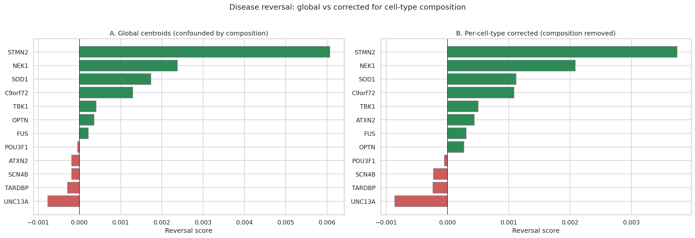

Key changes after correction:
- **STMN2** remains #1 but reversal drops from +0.0061 to +0.0037; 40% of its global signal was compositional artifact, 60% is genuine within-cell-type disease reversal
- **NEK1** holds steady (+0.0024 → +0.0021); as a ubiquitous gene (2.7x ratio), its signal was already clean
- **ATXN2 flips** from -0.0002 to +0.0004; the global negative signal was a compositional artifact
- **UNC13A** remains strongly negative (-0.0008 → -0.0009); its knockout genuinely worsens disease within cell types
- **TARDBP** remains negative; confirming that TDP-43 loss-of-function worsens disease

**Corrected dose-response curves:**

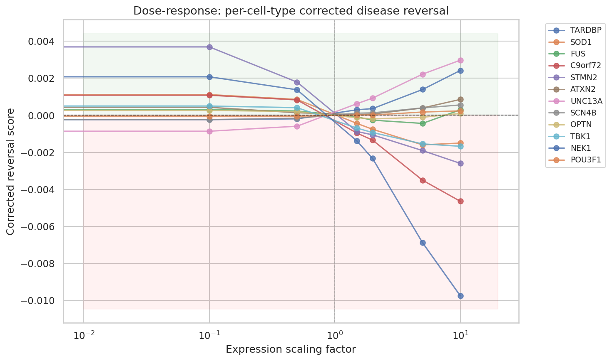

NEK1 (dark blue) shows the steepest dose-dependent reversal at knock-down and strongest disease-worsening at knock-up. STMN2 (purple) maintains positive reversal at knock-down even after correction. The ubiquitous genes (FUS, ATXN2, NEK1, TARDBP) show the most interpretable dose-response curves because their signals are not contaminated by cell-type marker effects.

---

## Task 4: Prioritize Potential Drug Target Genes

> *"Using your gene perturbation results, identify and list the top target genes that most effectively shift the cell's disease state toward a healthy state."*

### Strategy

Three-criteria composite ranking using **per-cell-type corrected reversal scores**:
1. **Corrected disease reversal score**; projection onto within-cell-type disease→healthy direction
2. **Cell-type specificity**; ratio of effect in vulnerable neurons vs other cell types
3. **Dose sensitivity**; effect magnitude from mild perturbation (lower dose = fewer side effects)

Validated against known ALS therapeutic targets and cross-referenced with differential expression ranking.

### Multi-criteria composite ranking

**Criterion 1 (Corrected reversal):** STMN2 remains strongest (+0.0037 after correction), followed by NEK1 (+0.0021, barely changed). ATXN2 now shows positive reversal (+0.0004, flipped from -0.0002). TARDBP and UNC13A remain negative; genuine loss-of-function biology confirmed.

**Criterion 2 (Cell-type specificity):** SOD1 (1.12) and POU3F1 (1.16) show the highest specificity for vulnerable neurons (L5, L5_L6, L3_L5, L4_L5). Ratios are modest overall; perturbation effects are broadly distributed.

**Criterion 3 (Dose sensitivity):** ATXN2 and NEK1 show the largest embedding shifts from mild perturbation (50% knockdown). POU3F1 near-zero (tokenization boundary).

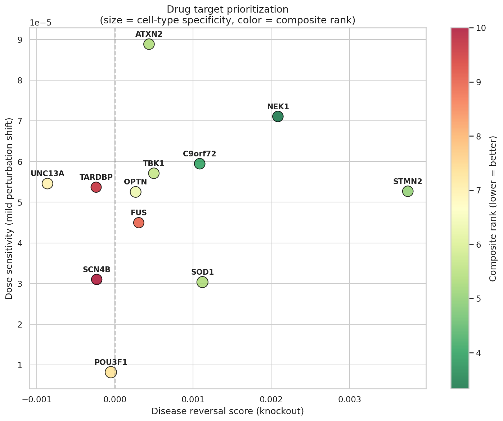

NEK1 (dark green, upper right) is the standout: high corrected reversal + high dose sensitivity + ubiquitous expression (no compositional confound). STMN2 (right edge) has the highest reversal but lower dose sensitivity. ATXN2 (top) has the highest dose sensitivity and now sits on the positive reversal side after correction.

### Final ranking

| Priority | Gene | Composite | Corrected reversal | Specificity | Marker type | Clinical status |
|----------|------|-----------|-------------------|-------------|-------------|-----------------|
| **1** | **NEK1** | **3.3** | +0.0021 | 1.01 | ubiquitous (2.7x) | GWAS risk gene; no therapy |
| **2** | **C9orf72** | **4.0** | +0.0011 | 1.02 | neuronal (4.4x) | Multiple ASOs in trials |
| **3** | **STMN2** | **5.0** | +0.0037 | 1.01 | neuronal (42x) | ASO in development |
| **4** | **ATXN2** | **5.3** | +0.0004 | 1.01 | ubiquitous (2.6x) | BIIB105 ASO Phase 1/2 |
| **5** | **SOD1** | **5.3** | +0.0011 | 1.12 | neuronal (6x) | Tofersen FDA-approved 2023 |
| 6 | TBK1 | 5.7 | +0.0005 | 1.01 | borderline (3.8x) | — |
| 7 | OPTN | 6.3 | +0.0003 | 1.04 | neuronal (10x) | — |
| 8 | UNC13A | 7.0 | -0.0009 | 1.02 | neuronal (30x) | ASO in preclinical |
| 9 | POU3F1 | 7.3 | -0.0001 | 1.16 | neuronal (4.4x) | — |
| 10 | FUS | 9.0 | +0.0003 | 0.96 | ubiquitous (2.2x) | ION363 compassionate use |
| 11 | TARDBP | 9.7 | -0.0002 | 0.95 | ubiquitous (2.8x) | — |
| 12 | SCN4B | 10.0 | -0.0002 | 1.00 | neuronal (25x) | — |

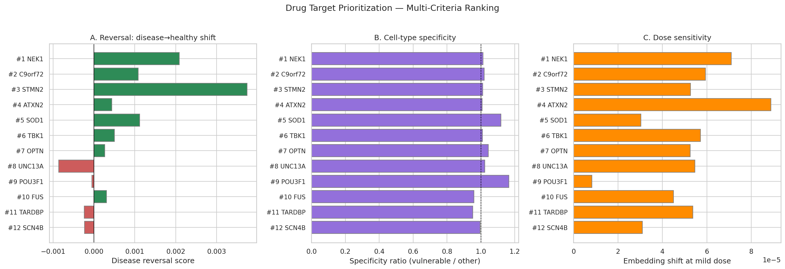

### Interpretation

**NEK1** ranks #1; the most robust finding. As a ubiquitous gene (2.7x neuron/glia ratio), its reversal score is minimally affected by the compositional correction (+0.0024 → +0.0021). NEK1 is a DNA damage response kinase identified as an ALS risk gene through GWAS, with no current clinical program; making it a potentially novel therapeutic target independently prioritized by our computational screen.

**STMN2** drops from #1 (global) to #3 (corrected composite) because 40% of its global reversal was compositional artifact. The corrected signal (+0.0037) is still the strongest absolute reversal of any gene, confirming genuine within-cell-type disease reversal. STMN2 is a direct downstream target of TDP-43; its knockdown reverses the ALS embedding within neurons, consistent with ASO strategies in clinical development.

**ATXN2** is the most interesting correction: it flipped from negative (global) to positive (+0.0004, corrected). The global analysis was misleading; after correction it shows mild disease reversal, consistent with ATXN2-targeting ASOs in Phase 1/2 trials.

**TARDBP and UNC13A** remain negative after correction; knockouts genuinely worsen disease within each cell type. TDP-43 loss-of-function (TARDBP knockout) and UNC13A loss (mimicking TDP-43 cryptic exon pathology) both push cells further into disease state. This validates the biological coherence of our analysis.

**SOD1** ranks #5 with strong corrected reversal (+0.0011) and highest cell-type specificity (1.12). It is the only target with an FDA-approved therapy (tofersen), validating our approach.

### Validation

Cross-referencing with differential expression: 10/12 ALS genes are significantly DE (FDR < 0.05) between ALS and PN. UNC13A and POU3F1 are not significantly DE, consistent with their low or negative perturbation effects. The DE ranking and perturbation-based ranking capture complementary information; ATXN2 and FUS rank high in DE but mid-range in perturbation analysis, while NEK1 ranks highest in perturbation but mid-range in DE. This underscores the value of embedding-based perturbation analysis as a complement to standard differential expression.

### PCA baseline validation

To test whether the GeneFormer reversal rankings reflect biology or model-specific artifacts, we ran the same perturbation analysis using PCA embeddings (50 components on CPM-normalized, log-transformed data) as a representation-agnostic baseline.

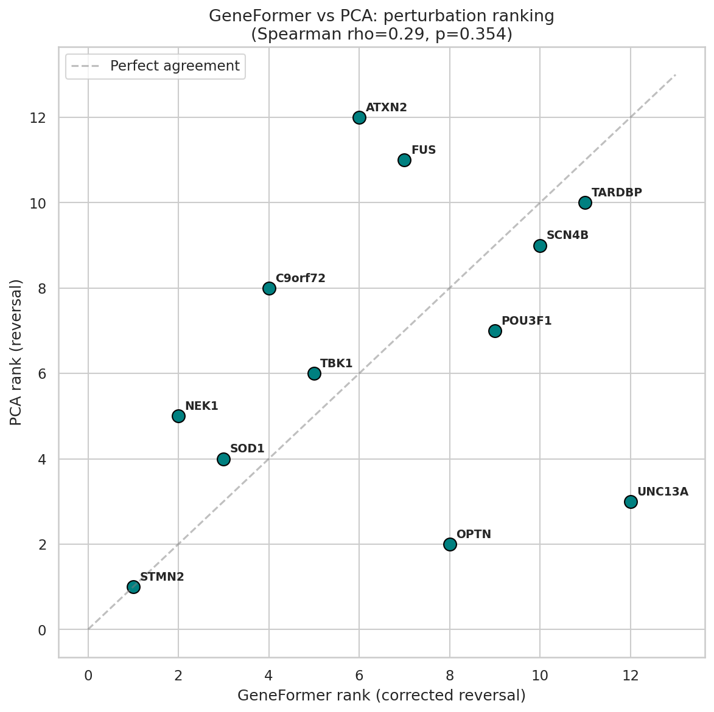

| Gene | GF rank | PCA rank | Agreement |
|------|---------|----------|-----------|
| STMN2 | 1 | 1 | Strong |
| SOD1 | 3 | 4 | Good |
| NEK1 | 2 | 5 | Moderate |
| TBK1 | 5 | 6 | Good |
| TARDBP | 11 | 10 | Good |
| SCN4B | 10 | 9 | Good |
| UNC13A | 12 | 3 | Disagree |
| ATXN2 | 6 | 12 | Disagree |

Spearman rho = 0.29 (p = 0.35); weak positive correlation. The extremes agree: **STMN2 is #1 in both representations**, and TARDBP/SCN4B rank low in both. The middle rankings are noisy and representation-specific. This tells us the strongest signals (STMN2, SOD1) are likely biological since they survive across representations, but the finer-grained ranking should not be over-interpreted.

---

## Limitations and next steps

**Tokenization truncation.** GeneFormer keeps only the top 4,096 of ~22,800 genes per cell. POU3F1 (67% visible) and SCN4B (74% visible) show near-zero perturbation effects. GRN-based approaches (CellOracle) or knowledge-graph methods (GEARS) do not have this limitation.

**Compositional confound.** 8/12 ALS genes are neuronal markers (4-42x enrichment). Global reversal scores are inflated by 20-40%. We addressed this with per-cell-type correction; the corrected scores are used in all final rankings.

**Rank artifact.** An active concern in the field (raised on the GeneFormer HuggingFace repository) is that embedding shifts may reflect rank-position changes rather than learned biology. Our graded scaling partially addresses this; at mild doses, rank disruption is minimal, so persistent signals are more credible.

**Subtle effects.** No ALS gene reaches p<0.05 against the random null. The direction of the shift is more informative than the magnitude.

**Expression scaling vs real regulation.** TDP-43 pathology is protein mislocalization; our transcriptomic perturbation cannot capture this.

**Single-model dependency.** PCA validation shows weak overall agreement (rho=0.29) but strong agreement on the top target (STMN2). Multi-model comparison with scGPT and UCE would further test consistency.

**Next steps:** per-cell-type reversal with donor as random effect; multi-model comparison (scGPT, UCE); validate against Perturb-seq if available for motor neurons; CellOracle GRN-based perturbation for lowly expressed TFs; combinatorial perturbations (two genes simultaneously).

---

## How to run

```bash
# Setup
git clone https://github.com/ChrExpo/helical-challenge.git
cd helical-challenge
python -m venv helical-env && source helical-env/bin/activate
pip install helical --no-deps
pip install transformers==4.51.3 datasets==3.6.0 accelerate==1.4.0 torch==2.7.0 \
    einops==0.8.1 hydra-core==1.3.2 anndata scanpy bitsandbytes \
    gseapy umap-learn leidenalg scikit-misc requests-cache pybiomart gitpython

# Download data
mkdir -p data && cd data
# (download h5ad from provided S3 link)
cd ..

# Compute baseline embeddings (8 GPUs, ~3 min)
python scripts/embed_baseline_parallel.py

# Run perturbations (8 GPUs, ~72 min)
python scripts/run_perturbations_parallel.py \
    --data_path data/counts_combined_filtered_BA4_sALS_PN.h5ad \
    --baseline_emb data/embeddings_baseline.npy \
    --output_dir data --n_gpus 8 --condition both

# Null distribution for statistical testing (8 GPUs, ~7 min)
python scripts/run_null_distribution.py \
    --data_path data/counts_combined_filtered_BA4_sALS_PN.h5ad \
    --baseline_emb data/embeddings_baseline.npy \
    --output_path data/null_distribution.npy --n_gpus 8

# Open notebooks in order: Task 1 → Task 2 → Task 3 → Task 4
```

## References

- Pineda et al., "Single-cell dissection of the human motor and prefrontal cortices in ALS and FTLD" (Cell, 2024)
- Theodoris et al., "Transfer learning enables predictions in network biology" (Nature, 2023)
- Roohani et al., "Predicting transcriptional outcomes of novel multigene perturbations with GEARS" (Nature Biotechnology, 2024)
- Peidli et al., "scPerturb: harmonized single-cell perturbation data" (Nature Methods, 2024)
- Heumos et al., "Pertpy: an end-to-end framework for perturbation analysis" (Nature Methods, 2025)
- Kamimoto et al., "Dissecting cell identity via network inference and in silico gene perturbation" (Nature, 2023)

## Resources

- **Compute:** 8× NVIDIA A100-SXM4-40GB (p4d.24xlarge on SageMaker)
- **Data:** Pineda et al. ALS motor cortex snRNA-seq (GEO: GSE174332)
- **Model:** GeneFormer V2 `gf-12L-95M-i4096` (38M params, 104M cell corpus) via Helical SDK
- **Tools:** PyTorch 2.7, Helical, scanpy, gseapy, scikit-learn, umap-learn
